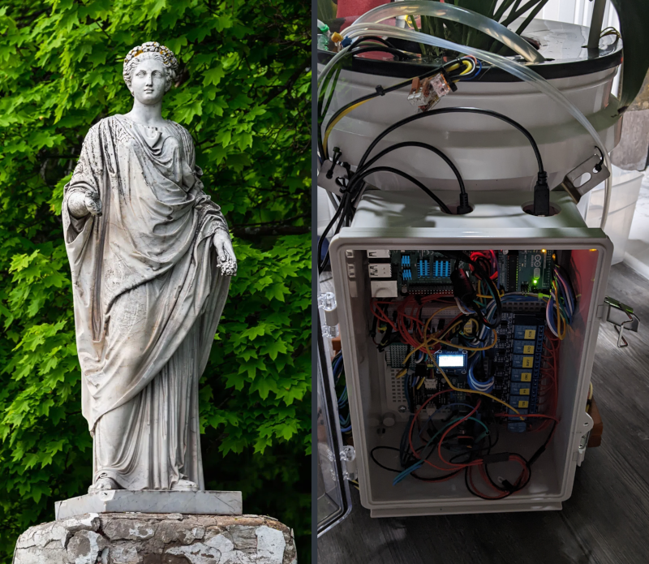
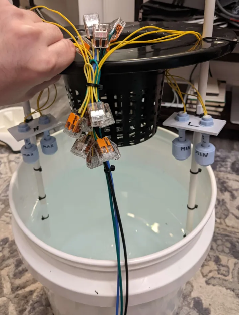
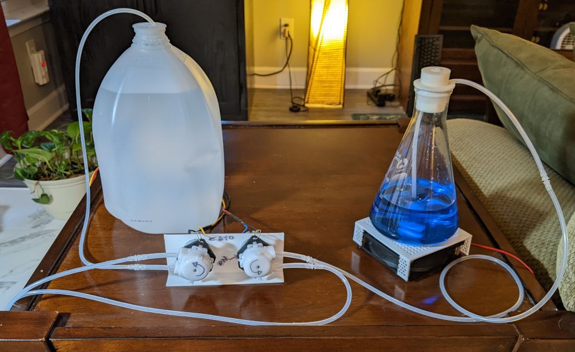
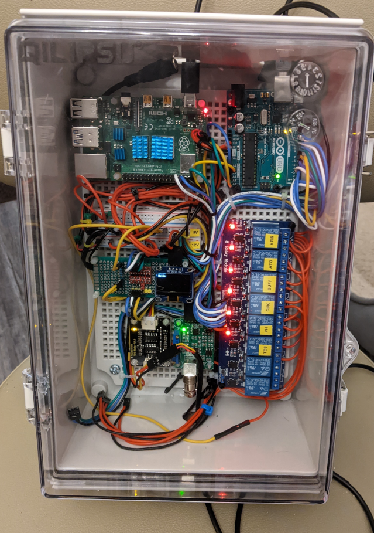
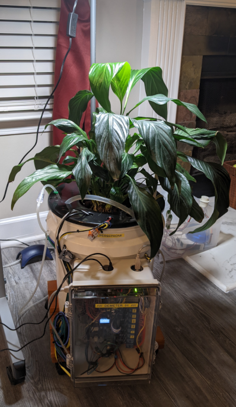

move shared values into .env/.env.example like port and baudrate.

log this somewhere..

sudo apt-get install python3-pip
python3 -m venv venv
sudo apt-get install redis

# Demeter

Demeter is an Arduino & Raspberry Pi-based hydroponics robot.

Presently, it tracks:
- water level high (redundant float switches)
- water level low (redundant float switches)
- water pH
- water temperature
- water TDS (Total Dissolved Solids ppm)
- volume of distilled/RO water dispensed
- volume of pH buffer dispensed

-and controls:
- a 5v magnetic stirrer for pH buffer solution administration
- a 12v peristaltic  pump for pH buffer solution administration
- a 12v peristaltic  pump for distilled/RO water auto-top-off
- a 12v submerged pump for reservoir circulation

-while logging to:
- redis
- AdaFruit.IO

Tested on a 13 year old peace lilly.

## System Tour

### Redundant Float Switches

These floats still need to be shrouded to protect them from tangling roots. For both min and max water levels, two float switches are wired in series.

#### Max Level Floats
The maximum level float switches are oriented normally-closed. Only one max level switch needs to open (rise) for the system to respond.

#### Min Level Floats
While also wired in series, the minimum float switches are, however, oriented normally-open. Both minimum floats must close (sink) before the system will respond.

### Peristaltic Pumps & Magnetic Stirrer

Water ATO (Auto Top-Off) and pH buffer solution pumps. The buffer needs to be mixed prior to pumping. An additional, third pump inside the reservoir circulates the water during buffer administration.

### Control Board

The control board has 3 different DC voltage circuits:
- 3.3v via Arduino (TDS sensor)
- 5v via Arduino (pH sensor, magnetic stirrer, temperature probe)
- 12v via external power supply (2 peristaltic pumps, 1 circulation pump)

-and includes:
- Arduino Uno
- Raspberry Pi 4 B
- 128x64 OLED display
- 8 channel relay board
- 4 channel logic level shifter
- pH sensor board
- TDS sensor board

### Testing

Day 2 of transplant shock.. This peace lily has spent the previous 13 years in dirt.
